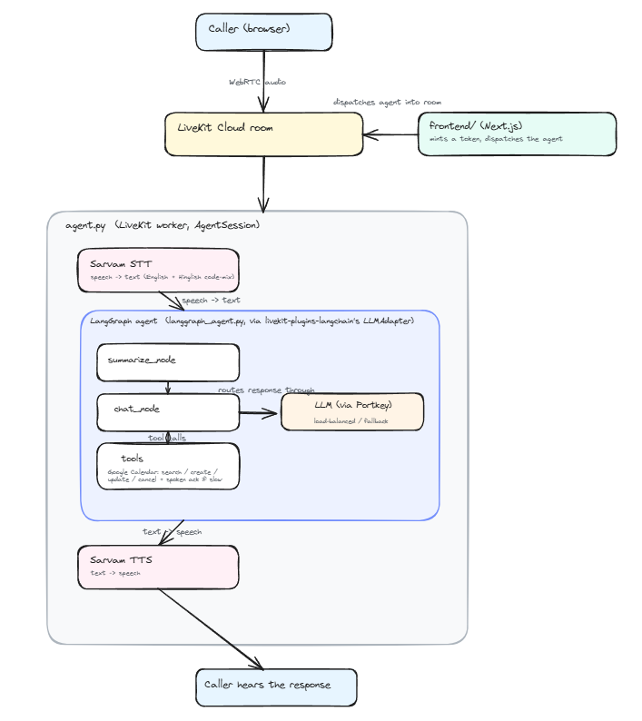

# Interior Design Voice Agent

An AI interior design assistant delivered as a real-time voice conversation over
[LiveKit](https://livekit.io). It holds a natural discovery conversation about a caller's
home — room type, style, budget, furniture, colors, lifestyle, renovation goals — offers
general design guidance along the way, and, when the caller shows interest, books a
consultation with a professional interior designer directly onto Google Calendar.

The agent currently speaks as **Aethel Studio**'s design assistant (see
`langgraph_agent.py`'s system prompt and `agent.py`'s greeting) — change the studio name in
those two files to rebrand it.

## How it works



Editable source: [`architecture.excalidraw`](architecture.excalidraw) (open at
[excalidraw.com](https://excalidraw.com) or with the Excalidraw VS Code extension).

Other things the agent handles on its own:
- **Silence/away handling** — nudges the caller if they go quiet, says goodbye and hangs up
  if they stay silent.
- **Concurrent callers** — each browser session gets its own LiveKit room and its own
  LangGraph thread, so simultaneous calls don't cross-talk.
- **Tracing** — a custom OpenTelemetry span processor (`langsmith_processor.py`) reshapes
  LiveKit's STT/LLM/TTS/tool spans into a single coherent LangSmith conversation thread,
  including which Calendar tools ran, with what arguments and results.

## Repository layout

| Path | Purpose |
|---|---|
| `agent.py` | LiveKit worker entry point. Builds the `AgentSession` (STT/LLM/TTS), wires up tracing and Google credentials, handles silence/away and hangup. |
| `langgraph_agent.py` | The agent's brain: the LangGraph graph, the system prompt, the Google Calendar tool wrappers, conversation summarization. |
| `langsmith_processor.py` | OpenTelemetry → LangSmith span translator. |
| `reauth_google.py` | One-time local script to produce `token.json` for Google Calendar OAuth. |
| `agent.ipynb` | Notebook mirror of the agent logic for interactive iteration (not part of the deployed path). |
| `frontend/` | Next.js browser client — joins the LiveKit room and mints access tokens. Has its own `CLAUDE.md`/`AGENTS.md` with Next.js-specific rules. |
| `Dockerfile` | Backend-only production image (`frontend/` is excluded); runs `python agent.py start`. |

## Prerequisites

- Python 3.13 (see `.python-version`) and [`uv`](https://docs.astral.sh/uv/) (or plain `pip`)
- Node.js 20+
- A [LiveKit Cloud](https://cloud.livekit.io) project
- API keys: [Sarvam AI](https://www.sarvam.ai) (STT/TTS), [Groq](https://groq.com),
  [Portkey](https://portkey.ai) (LLM gateway), a Google Cloud project with the Calendar API
  enabled
- Optional: a Postgres database (for conversation persistence across reconnects) and a
  LangSmith project (for tracing)

## Setup

### Backend

```bash
uv sync                      # or: pip install -r requirements.txt
```

Create `.env` in the repo root (see [Environment variables](#environment-variables) below).

Set up Google Calendar OAuth once, locally:
```bash
python reauth_google.py      # produces token.json alongside your credentials.json
```
`credentials.json` and `token.json` are gitignored — download `credentials.json` from your
Google Cloud project's OAuth client, then run the script above to complete the consent flow
and generate `token.json`.

### Frontend

```bash
cd frontend
npm install
```
Frontend needs its own `.env.local` with `LIVEKIT_URL`, `LIVEKIT_API_KEY`,
`LIVEKIT_API_SECRET` (same LiveKit project as the backend).

## Running locally

In two terminals:

```bash
# Terminal 1 — backend worker
python agent.py dev

# Terminal 2 — frontend
cd frontend && npm run dev
```

Open the frontend (default `http://localhost:3000`), join a room — it dispatches the agent
worker into a freshly generated room and connects your browser's mic/speaker to it.

Other backend worker modes:
```bash
python agent.py start        # production mode (what the Dockerfile CMD runs)
```

## Environment variables

Backend (`.env`, loaded via `python-dotenv`):

| Variable | Purpose |
|---|---|
| `LIVEKIT_URL`, `LIVEKIT_API_KEY`, `LIVEKIT_API_SECRET` | LiveKit project credentials |
| `SARVAM_API_KEY` | Sarvam STT/TTS |
| `GROQ_API_KEY` | Groq, called directly (not through Portkey) for small utility calls — tool-ack phrases, conversation summarization |
| `PORTKEY_API_KEY` | Portkey gateway, which routes the main conversational LLM (its provider credentials for the Groq/Fireworks targets it load-balances/falls back across are configured in the Portkey dashboard, not read from this repo's env vars) |
| `FIREWORKS_API_KEY` | *Optional here* — only needed if you call Fireworks directly outside of Portkey's own routing config |
| `GOOGLE_API_KEY` | Google Cloud / Calendar API |
| `DATABASE_URL` | *Optional.* Enables a Postgres-backed LangGraph checkpointer for conversation persistence across turns/reconnects. Without it, the graph runs with no persistence. |
| `OTEL_EXPORTER_OTLP_ENDPOINT`, `OTEL_EXPORTER_OTLP_HEADERS`, `OTEL_EXPORTER_OTLP_TIMEOUT` | *Optional.* LangSmith tracing via OpenTelemetry. |
| `CARTESIA_API_KEY` | *Optional,* only needed if you swap in Cartesia for TTS/STT. |

Google Calendar auth is file-based locally (`credentials.json` + `token.json`, both
gitignored). In deployment, those files won't exist in the image — `agent.py`'s
`setup_google_credentials()` reconstructs them at startup from `GOOGLE_CREDENTIALS_JSON` /
`GOOGLE_TOKEN_JSON` env vars instead.

Frontend (`frontend/.env.local`): `LIVEKIT_URL`, `LIVEKIT_API_KEY`, `LIVEKIT_API_SECRET`.

## Deployment

- **Backend** — Railway (or any Docker host), building the root `Dockerfile` directly. It
  only packages the Python backend (`frontend/` is excluded via `.dockerignore`) and runs
  `python agent.py start`.
- **Frontend** — deploys separately; `frontend/railway.json` forces the Nixpacks builder on
  Node 20+.

## Notes

- There is no automated test suite in this repo currently — changes are verified by running
  the worker locally (`python agent.py dev`) against a real LiveKit room.
- `frontend/` has its own `CLAUDE.md`/`AGENTS.md` with Next.js-specific conventions — read
  that before making frontend changes.
